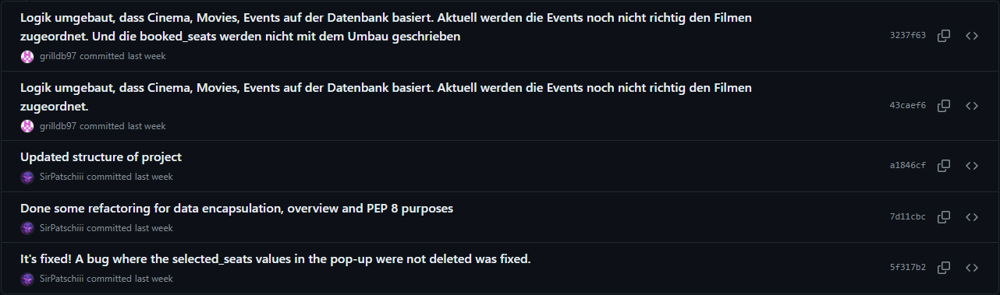
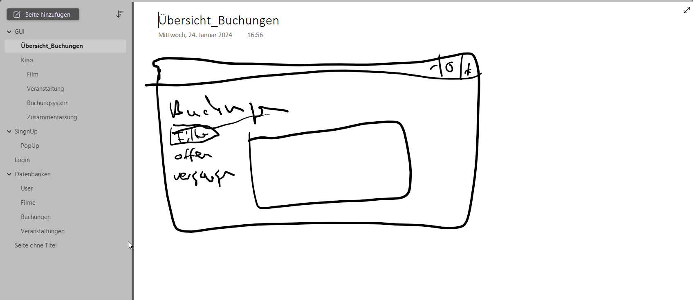

<!-- https://github.com/skills/communicate-using-markdown -->


# Grading Criteria Programmieren T3INF1004
In jedem Unterbereich werden die Punkte (gerne auch Links ins GIT) erklärt, wie das LO erreicht worden ist.
Alle Kriterien betreffen nur die Projektarbeit. Beweismaterial kommt aus dem Gruppenprojekt.

## FACHKOMPETENZ (40 Punkte)

# Die Studierenden kennen die Grundelemente der prozeduralen Programmierung. (10)
Unter der prozeduralen Programmierung versteht man eine Aufteilung des Gesamtproblems in kleine Teilprobleme.
```python
    def update_gui(self):
        # This method changes the GUI state if a user clicked a button.
        if self.__gui_status == "main":
            self.__update_gui_main_menu()
        elif self.__gui_status == "cinema":
            self.__update_gui_cinema_menu()
        elif self.__gui_status == "movie":
            self.__update_gui_movie_menu()
        elif self.__gui_status == "event":
            self.__update_gui_event_menu()
        elif self.__gui_status == "booking":
            self.__update_gui_booking_menu()
        else:
            sys.exit(-1)
```
Hier wird die Gesamtproblematik der Darstellung der verschiedenen Oberflächen in kleine Teilprobleme unterteilt, indem
jede einzelne Oberfläche separat behandelt wird.

# Sie können die Syntax und Semantik von Python (10)
```python
# This loop creates the button and places them in the correct spot
        for row in range(rows):
            for col in range(cols):
                seat_number = row * cols + col + 1
                button_x = start_x + col * (button_width + padding_x)
                button_y = start_y + row * (button_height + padding_y)
                color = booked_seats[seat_number - 1]

                # every button gives his number to the set_seats_clicked, if they selected
                button = tk.Button(self.__window, text=str(seat_number),
                                   command=lambda num=seat_number: self.set_seats_clicked(num),
                                   width=5, height=2, bg=color)
                button.place(x=button_x, y=button_y)
                if button.cget("bg") == "red":
                    button.config(state="disabled")
                self.__btn_booking_btn_list.append(button)
```
Auf diese Stelle sind wir besonders stolz, denn hier werden im Prinzip aus einer Liste mit 0 und 1 alle Buttons 
erstellt und im gleichen Zuge wird der Status jedes Buttons gesetzt, sprich ist der Sitz belegt ist, dann 
state="disabled", falls er noch frei ist, dann state="enabled".

In diesem Codeabschnitt werden mehrere grundlegende Elemente der Pythonprogrammierung verwendet.
Zum einen wird hier eine "nested for-loop" verwendet welche die korrekte Anordnung der Sitze sicherstellt.
Diese Sicherstellung wird unter anderem mit der darauf folgenden Rechnung erzielt.
Des Weiteren werden in der inneren Schleife neue Objekte vom Typ Button erstellt und abschließend wird auch noch mit
einer If-Verzweigung gearbeitet und eine Liste verwendet.

# Sie können ein größeres Programm selbständig entwerfen, programmieren und auf Funktionsfähigkeit testen (Das Projekt im Team) (10)
Die gemeinsame Bearbeitung kann durch die Einsicht in den 
[Commitverlauf](https://github.com/SirPatschiii/Kinobuchungsprogramm/commits/main/) genau nachvollzogen werden.

Hierbei gilt zu beachten, dass dieses Projekt stetig gemeinsam bearbeitet wurde und die Anzahl der Commits nicht
repräsentativ für die Beteiligung zu sehen ist.
Die Beteiligung erfolgte aus unserer Sicht in einem Verhältnis von 50 % zu 50 %.

Die gemeinsame Planung im Vorfeld kann auch in diversen Dateien nachvollzogen werden:
- [Projekt-Kinobuchungssystem.pdf](https://github.com/SirPatschiii/Kinobuchungsprogramm/blob/main/Projekt-Kinobuchungssystem.pdf)
- [Klassendiagramm Kinobuchungsprogramm.drawio](https://github.com/SirPatschiii/Kinobuchungsprogramm/blob/main/Klassendiagramm%20Kinobuchungsprogramm.drawio)
- [cinemadata.drawio](https://github.com/SirPatschiii/Kinobuchungsprogramm/blob/main/cinemadata.drawio)

# Sie kennen verschiedene Datenstrukturen und können diese exemplarisch anwenden. (10)
Als Beispiel wird hier die Methode "update_database()" herangezogen. Diese ist zuständig dafür, dass nach einer Buchung
die Datenbank auf den aktuellen Stand gebracht wird.
```python
    def update_database(self):
        try:
            self.__connect_db()
            # seperated the selected_seats list into individual seats
            selected_seats_str = ', '.join(str(seat) for seat in self.__selected_seats)

            # give not a return, if the selected_seats list is empty
            if selected_seats_str == '':
                return None
            cinema_title = self.__selected_cinema if self.__selected_cinema else ""

            # call the matching hall_id with the cinema_title from the database
            self.__cursor_db.execute("""
                SELECT hallID 
                FROM cinema 
                WHERE name=?""", (cinema_title,))
            hall_id = self.__cursor_db.fetchone()[0]

            # call the matching movie_id with the name of the selected_movie from the database
            self.__cursor_db.execute("""
                SELECT movieID 
                FROM movie 
                WHERE name=?""", (self.__selected_movie,))

            movie_id = self.__cursor_db.fetchone()[0]

            # call the matching event_id with the selected_event and the hall_id from the database
            self.__cursor_db.execute("""
                SELECT eventID 
                FROM events 
                WHERE date=? AND hallID=?""", (self.__selected_event, hall_id,))
            event_id = self.__cursor_db.fetchone()[0]

            # write the hall_id, movie_id, event_id, selected_seats_str together as a new record into the database
            self.__cursor_db.execute(
                "INSERT INTO bookings (hallID, movieID, eventID, selected_seats) VALUES (?, ?, ?, ?)",
                (hall_id, movie_id, event_id, selected_seats_str))
            self.__connect.commit()

            # updated the record of the booked_seats in the database
            self.__cursor_db.execute("""
                UPDATE events 
                SET booked_seats=? 
                WHERE eventID=? AND hallID=? AND movieID=?  """, (self.__booked_seats, event_id, hall_id, movie_id))
            self.__connect.commit()

            # call the booking_id of the last record of the database
            self.__booking_id = self.__cursor_db.lastrowid
            self.__disconnect_db()

            # output from the database written data
            return (self.__booking_id, cinema_title, self.__selected_movie, self.__selected_event,
                    self.__selected_seats)
        except Exception as e:
            print(f"Fehler beim Aktualisieren der Datenbank: {e}")
            return None
```
Zunächst wird hier mit einem try-except Block ein kleiner Errorhandler eingebaut. Dieser stellt sicher, dass es zu
keinem Programmabsturz kommt, falls auf dem Weg bis hier hin etwas schiefgegangen sein sollte.

Danach wird eine String-manipulation durchgeführt. Hierbei wird eine Liste durchgegangen und die einzelnen Elemente
werden mit einem Komma getrennt.

Im Anschluss daran wird dann mit einer If-Verzweigung geprüft, ob der String auch Inhalt besitzt.
Danach wird Schritt für Schritt jede Tabelle der Datenbank aktualisiert und die Verbindung zur Datenbank wird 
geschlossen.

Zum Schluss werden dann noch die Buchungsdaten zurückgegeben, damit der Nutzer eine Buchungszusammenfassung
einsehen kann.

## METHODENKOMPETENZ (10 Punkte)

# Die Studierenden können eine Entwicklungsumgebung verwenden um Programme zu erstellen (10)
Für die Umsetzung des Projektes wurden verschiedene Tools verwendet. Hier eine kleine Übersicht:
1. Unsere Entwicklungsumgebung war PyCharm

2. Als Version-Control wurde GitHub verwendet

3. Für die Unterstützung wurde z. B. ChatGPT verwendet

4. Zur gemeinsamen Projektplanung wurde Draw.io verwendet ...

5. aber auch OneNote


## PERSONALE UND SOZIALE KOMPETENZ (20 Punkte)

# Die Studierenden können ihre Software erläutern und begründen. (5)
Tom hat Dustin beim Debuggen unterstützt und hat die Funktionen vom Debugger näher erläutert.

Dustin hat Tom beigebracht wie man mit Python Daten in eine Datenbank schreibt aber auch wieder ausließt.

# Sie können existierenden Code analysieren und beurteilen. (5)
Wir haben die Gruppe des Karteikartensystems bewertet mit folgender 
[grading criteria](https://github.com/SirPatschiii/Kinobuchungsprogramm/blob/main/grading_external.md).
<!-- Pro Gruppe:You have critiqued another group project. Link to your critique here (another wiki page on your git) and link the project in the critique, use these evaluation criteria to critique the other project. Make sure they get a top grade after making the suggested changes -->

# Sie können sich selbstständig in Entwicklungsumgebungen und Technologien einarbeiten und diese zur Programmierung und Fehlerbehebung einsetzen. (10)
Wir haben in unserem Projekt einige neue Technologien eingesetzt. Hier eine kleine Übersicht:
- SQLite3
```python
    self.__cursor_db.execute(f"""
        SELECT e.booked_seats
        FROM events e
        INNER JOIN movie m ON e.movieID = m.movieID
        WHERE e.hallID = '{hall_id}' AND m.name = '{movie}' AND e.date = '{selected_event}' """)
```
- Tkinter
```python
    self.__fra_movie_fra1 = tk.Frame(self.__window, width=55, height=5)
    self.__fra_movie_fra1.place(x=550, y=70)
    self.__txt_movie_txt1 = tk.Text(self.__fra_movie_fra1, width=50, height=5)
    self.__scb_movie_scb1 = tk.Scrollbar(self.__fra_movie_fra1)
    self.__txt_movie_txt1.pack(side=tkinter.constants.LEFT, fill=tkinter.constants.Y)
    self.__scb_movie_scb1.pack(side=tkinter.constants.RIGHT, fill=tkinter.constants.Y)
    self.__scb_movie_scb1.config(command=self.__txt_movie_txt1.yview)
    self.__txt_movie_txt1.config(yscrollcommand=self.__scb_movie_scb1.set)
    self.__txt_movie_txt1.insert(tkinter.END, self.movie_descriptions[0])
    self.__txt_movie_txt1.config(state=tk.DISABLED)
```
- Logging
```python
    if not log.root.handlers:
        __log_file = Path(__file__).resolve().parent / 'logfile.log'
        if __log_file.exists():
            __log_file.unlink()
            time.sleep(0.1)

        log.basicConfig(filename=__log_file, level=log.DEBUG)

    log.debug("GUI works!")
```
- MVC-Architektur
```python
from GUI import GUI
from Cinema import Cinema
from Movie import Movie
from Event import Event
from Booking import Booking


class Controller:
    def __init__(self):
        # This method initializes the Controller object and creates all objects which are required for the
        # MVC architecture
        self.__o_gui = GUI(self)
        self.__o_cinema = Cinema()
        self.__o_movie = Movie()
        self.__o_event = Event()
        self.__o_booking = Booking()

        log.debug("Controller works!")

        self.__o_gui.create_gui()
```

## ÜBERGREIFENDE HANDLUNGSKOMPETENZ (30 Punkte)

# Die Studierenden können eigenständig Problemstellungen der Praxis analysieren und zu deren Lösung Programme entwerfen (30)
<!-- Which parts of your project are you proud of and why (describe, analyse, link) -->
<!-- Where were the problems with your implementation, timeline, functionality, team management (describe, analyse, reflect from past to future, link if relevant) -->


## Kenntnisse in prozeduraler Programmierung:

# - Algorithmenbeschreibung

# - Datentypen

# - E/A-Operationen und Dateiverarbeitung

# - Operatoren

# - Kontrollstrukturen

# - Funktionen

# - String-Verarbeitung

# - Strukturierte Datentypen


